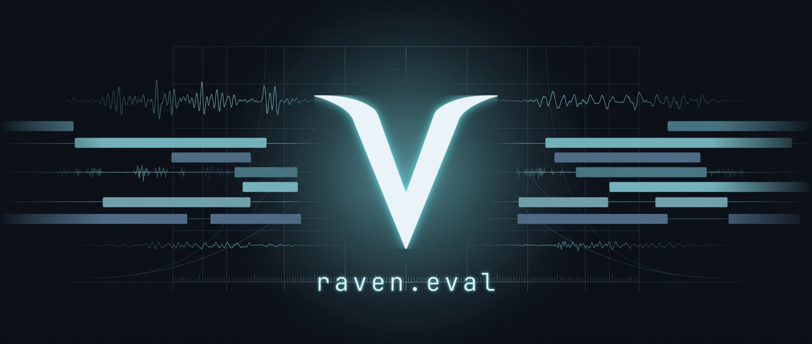

<p align="center">
  
</p>

# raven.eval

**Verify Raven's speech-AI quality numbers yourself — on public data, with your own scorer.**

Raven publishes measured numbers for German speech recognition (**WER**, word error
rate) and speaker diarization (**DER**, diarization error rate). This repository is
the open toolkit that lets *anyone* reproduce them independently, on freely available
public datasets, without access to Raven's private data or infrastructure. The scoring
code here is the same code Raven runs internally — lifted out, stripped of anything
private, and packaged so a stranger can check our work.

## It reproduces the vendors' own benchmarks

On VoxConverse **test**, our scorer measures **11.15 % DER** for
`pyannote-community-1` against pyannote's own published **11.2 %** — a **0.05 pp**
delta, computed here from committed RTTMs with `make verify` (no GPU, no gated model).
If our instrument reproduces the vendor's number on their benchmark, you can trust the
same instrument on the datasets they *don't* publish.

## What's reproducible today

| metric | dataset | number | comparison |
|--------|---------|--------|------------|
| **DER** | VoxConverse test (EN, in-the-wild) | **11.15 %** @ collar 0.0 | pyannote card **11.2 %** ✓ (Δ 0.05 pp) |
| DER | VoxConverse dev (EN) | 7.17 % @ collar 0.0 | easier split |
| **DER** | CALLHOME-de (DE, telephone) | **16.08 %** @ collar 0.25 | between pyannote 3.1 (19.0) & pyannoteAI (8.3) |
| **WER** | Tuda-De / CommonVoice / MLS (DE) | 2.6–4.0 % | flozi dataset-card anchors |

Full tables with per-file provenance and pinned model/dataset commits:
[**`BENCHMARKS.md`**](./BENCHMARKS.md). Every row is re-scored on every push by CI.
Cost re-computation is not yet wired; latency is Tier-3 (hardware/network-dependent,
not portably reproducible).

## Three levels of verifiability

Not every number is portably reproducible. We are explicit about which is which — and
we make the reproducible ones *actually* reproducible:

- **Tier 1 — verify in seconds, no GPU, no API keys.**
  We commit the model outputs (per-utterance transcripts for WER; gold + hypothesis
  RTTMs for DER) next to the gold references. `make verify` re-scores them and
  reproduces the published tables — WER **and** DER (both collars + miss/FA/conf) —
  using only `pyannote.metrics` and `jiwer`, no torch, no GPU. CI runs it on every
  push, so a number can't silently drift from its committed data.

- **Tier 2 — full re-run on public data (your own keys / GPU).**
  `make reproduce` downloads a public dataset, runs the pinned model, and scores it.
  WER on the `flozi00/asr-german-mixed-evals` subsets, and DER
  (`make reproduce METRIC=der`) with `pyannote/speaker-diarization-community-1` on
  VoxConverse / CALLHOME-de / AMI (needs an HF token, the gated model license, a GPU,
  and shared FFmpeg libs — see [`docs/TIER2-DER-KEYS.md`](./docs/TIER2-DER-KEYS.md)).
  You get the same numbers we publish.

- **Tier 3 — transparency only (not portably reproducible).**
  Latency / TTFT and any private-fixture result are documented with methodology and an
  explicit reason they can't be re-run elsewhere. No hidden numbers, no pretense.

## The scoring contract

Every DER/WER number states the exact rules it was computed under —
[`benchmark.config.yaml`](./benchmark.config.yaml). DER is reported at **both**
`collar=0.0` and `collar=0.25` (the two conventions are not comparable), so our
numbers line up with the pyannote model cards and the ETH benchmark paper
(arXiv 2509.26177). DER is always dataset-relative: the same model reads anywhere from
~7 % to ~27 % depending on the dataset — a bare "DER" without a stated dataset, collar
and overlap rule is noise.

## Quickstart

```bash
make install      # pinned env via uv (uv.lock)
make test         # scorer unit tests (the regression guard)
make verify       # Tier-1: re-score every committed number, no GPU / no keys
```

## What's inside

- **`raven_eval_core/`** — the standalone, secret-free metric core. `der.py`
  (Diarization Error Rate via `pyannote.metrics`, collar + overlap parametrized,
  Hungarian mapping, RTTM I/O) and `flozi_wer.py` (the single source of truth for
  published German WER — same normalization for the runner and the re-scorer, so they
  can't drift). No hardcoded names, no private data.
- **`raven_asr/`** — Tier-2 WER harness: pull a public HF subset → run a model
  (Modal / OpenAI / Deepgram / Mistral / vLLM adapter) → score → `predictions_*.jsonl`.
- **`raven_diar/`** — Tier-2 DER harness: prepare a public diarization dataset → run
  the pinned `pyannote-community-1` diarizer → score DER at both collars → gold/hyp
  RTTMs. Heavy deps behind the `diar` extra. Optional `make dscore-check` cross-checks
  against `nryant/dscore`.
- **`artifacts/`** — the committed proof: per-file references + hypotheses +
  `expected.json` for every published number, re-scored by `make verify`.
- **`scripts/verify.py`** — the Tier-1 re-scorer.

## Honesty (the whole point)

- **Public-dataset numbers are not Raven's private-meeting numbers.** Raven's internal
  eval runs on real customer meetings whose audio can't be published (consent); those
  are a separate, non-public datapoint. The numbers *here* are on public datasets and
  will differ — that's expected, and we don't blur them.
- **The demo fixtures** (`artifacts/_demo/`, `artifacts/_demo_der/`) prove the
  re-score mechanism end-to-end; they are **not** Raven product numbers.

## License

Code is **MIT**. Dataset licenses are separate and belong to their owners — see
[`NOTICE`](./NOTICE) for per-dataset attribution (Tuda-De / MLS = CC-BY, Common Voice
= CC0, VoxConverse labels = CC-BY, …). **We never redistribute restricted audio** —
only the tooling and, where the license permits, the reference/hypothesis label files.
